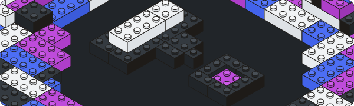

NOTE: This is a fork of https://github.com/HHogg/preshape that works with Next.js



# Postshape

A design system and component library for my own personal projects. Take a look around. However, you probably shouldn't use this in your project as there's no guarantee of stability or support.

## Using the library

Install with your favourite package manager

```
yarn add postshape
```

Add the CSS to your project, e.g.

```ts
import "postshape/dist/style.css";
```

then import and start using components.

```tsx
import { Box } from "postshape";

<Box>...</Box>;
```

## Documentation

Description of the design system and component documentation can be found on the [Postshape site](https://postshape.hogg.io).

## Development

### Prerequisites

- [Node](https://nodejs.org/en/)

- [Yarn](https://yarnpkg.com)

### Setup

Clone the repository

```
git clone git@github.com:xeoneux/postshape.git
```

Install the dependencies with your favourite package manager

```
yarn
```

Spin up the dev server

```
yarn dev
```

### Contribution

Postshape uses a strict commit message structure that follows the [Conventional Commits](https://www.conventionalcommits.org/en/v1.0.0-beta.4/) spec. This is used to automate publishing the package to NPM and generating the changelog with [Semantic Release](https://github.com/semantic-release/semantic-release).
